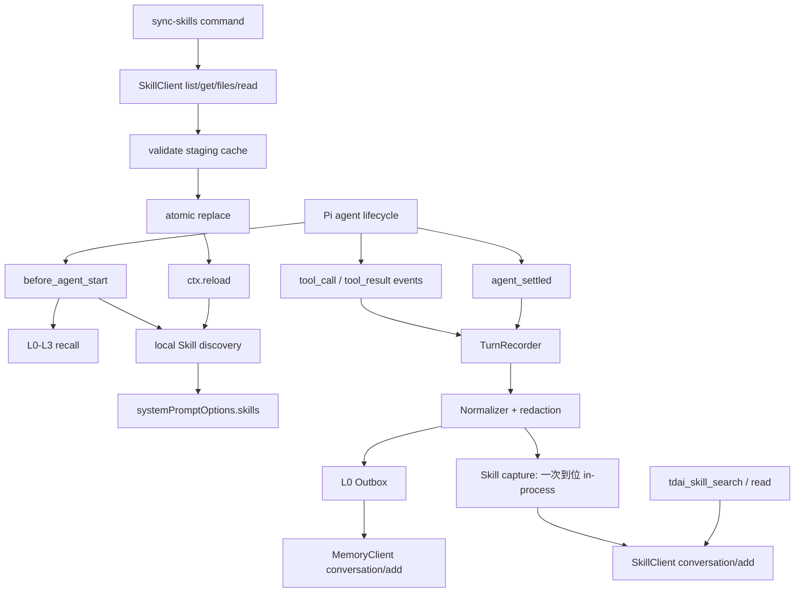

# Pi Adapter 完整 Skills 管线开发文档

状态：设计基线，待实现  
适用范围：`adapters/pi`  
更新时间：2026-08-17

本文不是 UI 方案，而是 Pi 适配器接入 TencentDB-Agent-Memory Skills 能力的实现规格。目标是让后续开发、测试和 PR 拆分都有明确边界。

## 1. 结论先行

当前 Pi 适配器已经具备：

- L0 对话采集；
- L1-L3 回忆检索；
- 跨进程 durable outbox；
- lease 心跳和过期 lease 回收；
- UTF-8 安全截断；
- 按 session 隔离运行态；
- 基础 setup、status、check、load、pack 流程。

当前还不算“完整 Skills 适配”，缺口集中在：

1. 没有调用官方 `/v3/skill/*` API；
2. 没有把一次真实回合规范化成官方 Skill 的 `user / assistant / tool_call / tool_result / system` 消息；
3. 没有 Skill 会话学习写入路径——L0 走 durable outbox，Skill 需要独立、一次到位、不自动重试的 at-most-once 追加语义（见 §6）；
4. 没有 Skill 搜索、读取文件、列出资源的原生只读工具；
5. 没有把远程 Skill 安全同步到 Pi 原生 `SKILL.md` 的缓存；
6. setup、status、flush、故障诊断没有覆盖 Skill；
7. 没有围绕“服务端已接收但响应丢失”“两个进程同时 flush”“同步资源恶意路径”等关键故障做验收。

因此，**第一版完整 Skills 管线不需要 UI**。原生只读工具、命令和状态输出已经足够交付。UI 可以作为后续 Skill 审核、版本比较和同步预览功能，不应成为本适配器 PR 的前置条件。

## 2. “完整”到底是什么意思

本项目中，完整 Skills 管线定义为以下五件事同时成立：

| 能力 | 完成标准 |
|---|---|
| 学习写入 | 每个已结束回合可以独立写入 L0 和 Skill conversation；一个失败不阻塞另一个 |
| 规范化 | 工具调用和工具结果按 `tool_call_id` 配对，过滤系统提示、思维链、图片和敏感信息 |
| 运行时读取 | Agent 可以通过原生只读工具搜索和读取 Skill，不需要学习 `curl` 或内部 bridge |
| 本地生效 | 用户显式确认后，远程 Skill 和资源可以安全落地为 Pi 可发现的 `SKILL.md` |
| 运维恢复 | 有重试、死信、顺序、状态、手动 flush、session 关闭 drain 和关键故障测试 |

以下承诺不属于当前适配器可以单方面保证的范围：

- **无法保证远程 API 的 exactly-once。** 当前 `conversation/add` 协议没有适配器可使用的幂等键。如果请求已经被服务端接受，但响应在网络中丢失，客户端无法判断重试是否会重复写入。因此 L0 只能保证 durable at-least-once；而 Skill 恰恰不能容忍重复（服务端缓冲与 tool_call 计数跨批次累计），所以 Skill 采用 **at-most-once**——一次到位、模糊失败不自动重试、宁可丢一个回合的学习素材也不重复追加。两个边界都必须写进状态和文档（见 §6）。
- **无法保证异步抽取立即可搜索。** Skill extraction 是异步过程，`conversation/add` 返回 `archived` 只代表归档/入队成功，不代表新 Skill 已经完成索引。
- **不能自动执行远程资源。** 远程 Skill 内容在显式同步并通过本地校验前都属于不可信输入。默认不允许执行资源，不自动改写本地 Skill。

## 3. 官方能力模型

本节以仓库内 MemoryCore、MemoryProxy 和 TypeScript SDK 的实际实现为准，主要对照：

- `MemoryCore/src/core/skill/`
- `MemoryCore/src/api/v3/skill/`
- `sdk/memory-core/typescript/src/v3/skill-types.ts`
- `sdk/memory-core/typescript/src/v3/skill-client.ts`
- `MemoryProxy/src/skill/`

### 3.1 Skill 不是一段提示词

一个 Skill 至少包含：

- Skill 身份和元数据；
- 当前版本；
- `SKILL.md` 主体；
- 可选资源文件；
- 触发描述；
- 版本并发控制；
- 所属团队、创建 Agent、拥有者和可见性；
- 从对话中异步抽取形成 Skill 的任务状态。

因此，适配器不能只把 Skill 内容拼接进 system prompt，也不能把一次对话直接当成 Skill 文本上传。需要同时处理：

1. conversation learning；
2. Skill asset discovery；
3. Skill file/resource；
4. local trust and activation。

### 3.2 SDK 需要覆盖的核心 API

官方 SDK 已经提供以下能力。Pi 不必一次暴露全部能力，但客户端层应先把它们分组，避免以后让命令直接拼 URL。

| 分组 | API |
|---|---|
| 生命周期 | `create`、`get`、`update`、`patch`、`delete` |
| 查询 | `list`、`search`、`versions`、`listing` |
| 文件 | `files/write`、`files/remove`、`files/read` |
| 抽取 | `extract` |
| 对话写入 | `conversation/add`、`conversation/force-archive` |

第一版 Pi 适配器的最低客户端范围：

- 必须：`conversation/add`、`conversation/force-archive`；
- 必须：`search`、`get`、`listing`；
- 必须：`files/read`；
- 同步需要：`versions` 或带版本字段的 `get/list`；
- 后续管理功能：`create/update/patch/delete/files/write/files/remove/extract`。

### 3.3 conversation/add 的消息协议

每次写入至少需要：

```text
session_id
user_id
team_id
agent_id
messages[1..500]
```

可选字段包括 `space_id` 和 `task_id`。所有 ID 不能包含 `|`。

支持的角色为：

```text
user
assistant
tool_call
tool_result
system
```

`tool_call` 和 `tool_result` 必须通过同一个 `tool_call_id` 配对。`tool_name` 可以携带工具名，但不能代替 `tool_call_id`。

当前核心默认归档条件大致是：

- 一批消息中有至少 10 个工具调用；或
- 消息压缩后超过约 40 KiB；
- 单次过大的输入也会被归档。

这些阈值属于服务端策略，适配器不应复制一份“猜测逻辑”来决定是否写入。适配器应尽量提交完整回合，服务端返回 `ok` 或 `archived` 后再决定删除本地队列记录。

## 4. 现有适配器对比

### 4.1 MemoryProxy 的 Claude Code / CodeBuddy 适配

MemoryProxy 解决的是“LLM 运行在代理协议后面，不能方便注册原生工具”的问题：

- Claude Code 根据 `cache_control` 等标记区分主回合、fork、side query；
- CodeBuddy 从 OpenAI 风格消息中的伪 XML 提取真正的用户问题；
- handler glue 只取当前回合的最终 assistant，并把协议转换为官方五角色；
- Skill 注入器在 session 初始化时缓存 listing，缓存未命中时再实时补取；
- Skill Bridge 用 HTTP bridge 让模型通过 `curl` 读取资源；
- `allowLlmWrite` 默认关闭，写入权限由 bridge 统一控制；
- 写入失败通常只告警，不影响当前对话。

这些做法对 Proxy 有价值，但不能原样搬到 Pi：

- Pi 可以注册原生 tool，不需要教模型调用 `curl`；
- Pi 能拿到结构化 `tool_call` 和 `tool_result` 事件，可以做到更准确的配对；
- Proxy 当前没有本地 durable outbox，Pi 已有更好的基础设施；
- Proxy 的 adapter 主要负责协议归一化，Pi 还必须处理多进程、session 生命周期和本地 Skills 缓存。

### 4.2 OpenClaw plugin

OpenClaw 插件当前主要覆盖：

- L0 capture；
- L1/L0 memory search；
- COS 文件读取；
- `agent_end` 时写回对话。

它不是完整 Skill 管线，没有覆盖 Skill 版本、资源同步、Skill 文件读取和本地可信激活。

### 4.3 Pi 当前实现

当前 Pi 代码的主要边界：

| 文件 | 当前职责 | Skills 缺口 |
|---|---|---|
| `src/clients.ts` | MemoryClient、MetadataClient | 没有 SkillClient、文件读取客户端 |
| `src/config.ts` | endpoint、身份、L0-L3、captureTools | 没有 skills 配置 |
| `src/index.ts` | recall、agent_settled 捕获、两个 memory tool | 没有 Skill tool、没有 Skill lifecycle |
| `src/capture.ts` | L0 对话消息和简化工具证据 | 只保存工具结果，没有 call/result 配对 |
| `src/outbox.ts` | L0 CaptureRecord durable delivery | L0 专属；Skill 需要独立的一次到位机制（新模块，见 §6.3） |
| `src/setup.ts` | 验证 L0-L3 能力 | 没有 Skill capability/auth/resource 检查 |
| `src/status.ts` | Memory 状态 | 没有 Skill pending、cache、dead 状态 |

### 4.4 Pi 应该吸收什么，拒绝什么

应该吸收：

- Proxy 的协议归一化规则；
- Claude Code 对 fork/side query 的区分思路；
- 写权限默认关闭；
- listing 缓存和缓存未命中自愈；
- Skill 版本和资源文件的显式管理。

不应该照搬：

- 把 Skill 读取做成模型执行 `curl`；
- 把失败只打印 warning 后丢掉；
- 把系统 prompt、思维链和注入的 memory 当作用户真实对话写回；
- 让项目级配置覆盖全局 endpoint、身份和写权限；
- 用文件名或 mtime 代替 Skill 的版本和服务端并发控制。

## 5. 目标架构



### 5.1 两条写入管线必须独立

一次回合结束后生成两个独立记录，**投递语义不同**：

```text
Turn
 ├─ L0 record       -> MemoryClient   durable at-least-once
 └─ Skill record    -> SkillClient    at-most-once（一次到位，不自动重试）
```

原因：

- L0 是即时会话回忆，Skill 是长期抽取素材；
- Skill 服务故障不能阻塞 L0；
- Skill 写入必须"一次到位"：服务端对同一 session 的缓冲和 tool_call 计数是跨批次累计的（见 §6.1），durable 自动重试一旦遇到"服务端已接受但响应丢失"，就会把同一批消息再追加一遍，导致重复消息与提前归档；
- Skill 记录需要保存完整工具调用，而 L0 可以采用较小的摘要证据；
- 未来可以单独暂停 Skill capture，不丢失 L0。

### 5.2 运行时读取和本地同步是两条读路径

远程 Skill 读取：

```text
agent -> tdai_skill_search -> SkillClient.search
agent -> tdai_skill_read   -> SkillClient.get/files/read
```

本地 Skill 激活：

```text
user command -> preview -> confirm -> download -> validate -> atomic replace -> reload
```

远程搜索结果不应自动变成可执行的本地 Skill。只有显式同步成功后，才进入 Pi 的 `resources_discover` 路径。

## 6. 采集与投递语义（关键决策 D1）

Skill 学习写入与 L0 的投递语义必须不同。这一节先摆服务端事实，再给策略。

### 6.1 服务端事实：conversation/add 是增量追加，阈值跨批次累计

- `conversation/add` 把消息**追加**到该 `(team, agent, user, session)` 的会话缓冲，不覆盖、不删除；
- 归档阈值在 `add-handler.ts` 中按累计值判断：`nextTool = meta.tool_call_count + addedToolCalls`、`nextBytes = meta.byte_count + rawBytes`（`meta` 存于会话缓冲元数据，跨批次累计）；
- 只数 `tool_call` 不数 `tool_result`（两者 1:1 配对，数两遍等于阈值减半）；
- 默认 `toolCallThreshold = 10`、`bytesThreshold = 40 KiB`，达到即归档并触发异步抽取。

推论：**重复追加是有害的**。如果同一批消息被投递两次，缓冲里出现重复消息，tool_call 计数被双计，实际只有 5 次真实工具调用就可能提前归档，抽取出的 Skill 也会包含重复内容。

### 6.2 为什么不能给 Skill 配 durable 自动重试

L0 的 outbox 用 at-least-once：接受重复（服务端 L0 语义容忍），换取不丢。Skill 相反：

- 服务端没有适配器可用的幂等键（`conversation/add` 不含 request_id 语义）；
- 唯一危险场景是”服务端已接受但响应丢失”（网络中断、超时、进程在响应前崩溃）——此时客户端无法区分”已落地”和”未落地”；
- 一旦为 Skill 自动重试，就是把”可能已落地”的消息再追加一遍 → 落入 §6.1 的重复危害。

因此 Skill 采用 **at-most-once**：一次真实回合最多追加一次，宁可丢失一个回合的学习素材，也不能污染缓冲。

### 6.3 推荐投递策略

每回合结束时：

1. 先写入本地 pending 文件（磁盘持久化，防进程在发送前崩溃丢数据）；
2. 进程内**恰好发送一次** `conversation/add`；
3. 收到明确 `ok` / `archived` → 删除 pending；
4. 收到确定性 4xx（参数错误、权限、超限）→ 移入 dead-letter（带字段错误），不重试；
5. 网络失败 / 超时 / 5xx 等**模糊失败** → 不自动重试，标记 pending 为 `attempts=1, terminal=”uncertain”`，在 status 中显式列出，供操作者人工决定；
6. 进程崩溃：发送前崩溃 → 下个进程仍可见 pending 并发送（这是首次发送，不是重试）；发送中崩溃 → 与 5 相同，标记 uncertain，不重发。

**不需要**：

- 跨进程全局锁（同一 session 的追加在现实中由当前 Pi 进程串行持有会话文件而产生；即便个别场景下乱序到达，也只影响抽取输入顺序，不造成重复）；
- 每 session 序列号（回合是自包含的）；
- 按 `sessionId + sequence` 串行发送。

### 6.4 未来扩展

如果服务端日后为 `conversation/add` 增加幂等键或 request_id，适配器应把 pending 记录的 `id` 作为稳定幂等键传入，届时再把 Skill pending 升级为统一的 outbox v2 记录模型（把现有 `CaptureRecord` 扩展为带 `kind` 的判别联合：`memory-l0` / `skill-conversation`）。`version: 1` 的旧 L0 文件必须继续可读，迁移采用”读旧格式、写新格式”，不在升级时批量重写。

## 7. Pi 生命周期映射

### 7.1 before_agent_start

职责：

- 按当前 session 读取 L0-L3；
- 准备当前 session 的 Skill 状态；
- 不把上一 session 的 prompt、assistant、tool counter 带入当前 session；
- 仅把已经验证过的本地 Skill 交给 `systemPromptOptions.skills`；
- 不在这里自动下载远程 Skill。

`before_agent_start` 中的 recall 结果必须继续保持“不可信上下文”边界，不能把远程 Skill 内容当成系统指令。

### 7.2 tool_execution_start / tool_call

职责：

- 创建 `toolCallId -> pending call` 映射；
- 保存工具名和经过限制的参数；
- 不保存系统 prompt、密钥和未截断的大对象。

参数是否写入 Skill 需要递归脱敏和大小限制，不能只对最终字符串做一次正则替换。

### 7.3 tool_result

职责：

- 用 `toolCallId` 找到对应的 call；
- 保存结果、错误状态、工具名和受限后的内容；
- 允许并行工具完成顺序和调用顺序不同；
- 最终规范化时按 Pi 产生的 assistant source order 组织消息，不按到达时间猜顺序。

默认建议：

- 记录真实业务工具；
- 排除 `tdai_memory_search`、`tdai_conversation_search`、`tdai_skill_search`、`tdai_skill_read`，避免把记忆系统自己的回读结果再次训练成记忆；
- 失败工具默认不进入 Skill conversation，保留可配置开关供诊断场景开启；
- L0 可以继续保留短摘要证据，但不能把它当作 Skill 的完整工具协议。

### 7.4 agent_end

只保存最终 assistant 文本候选，不立即写入远程服务。`agent_end` 可能不是整个生命周期的最终成功边界。

### 7.5 agent_settled

这是一次回合的提交点：

1. 取得最终成功 assistant；
2. 取当前 session 的用户 prompt；
3. 关闭工具录制窗口；
4. 规范化成 Skill 五角色消息；
5. 创建独立的 L0 outbox 记录和 Skill pending 记录；
6. 在有界时间内尝试 flush：L0 走 durable at-least-once；Skill 一次到位，模糊失败即标记 uncertain，不重试；
7. flush 失败不能让本轮对话失败（fail-open）。

### 7.6 session_shutdown

执行有界 drain：

- 先 flush 当前进程产生的 pending；
- 到达超时就退出，剩余记录留在磁盘；
- 不强制等待远程服务恢复；
- 不持有旧的 context 继续调用 `ctx.reload`、`ctx.switchSession` 后的接口。

### 7.7 ctx.reload

`ctx.reload()` 后旧 context 可能 stale。所有 reload 后工作必须使用新传入的 context，不要在异步闭包中捕获旧的 `ctx`。这一点必须加入 extension command 和 Skill sync 的测试。

## 8. Conversation 规范化算法

### 8.1 输入

输入来自：

- 当前 session 的用户 prompt；
- assistant 最终文本；
- `tool_call` 事件；
- `tool_result` 事件；
- 可选 task/session 元数据。

不输入：

- 系统 prompt；
- memory recall 注入文本；
- 思维链和 hidden reasoning；
- 图片二进制；
- 其他 session 的事件；
- 适配器内部日志。

### 8.2 输出

推荐顺序：

```text
user
assistant                # 如果有最终答案前的 assistant 文本
tool_call                # 每个真实工具调用
tool_result              # 与 tool_call_id 对应
assistant                # 最终回答
```

如果当前 SDK/服务端要求按对话自然顺序，可以使用：

```text
user
assistant(tool_call)
tool_result
assistant(final)
```

关键不在于把所有事件塞进去，而在于：

- `tool_call_id` 配对正确；
- 不跨 session；
- 不重复写入；
- 并行工具不丢失；
- 最终 assistant 只出现一次。

### 8.3 脱敏和大小限制

必须在结构化对象层执行：

1. 识别 key 名：`authorization`、`apiKey`、`token`、`password`、`secret`、`cookie` 等；
2. 递归处理 object、array 和字符串；
3. 对每个工具参数和结果设置字节预算；
4. 最后再做 UTF-8 边界安全截断；
5. 为被截断内容保留短的元数据标记，不把原文拼回去。

不要使用“把对象 JSON.stringify 后再做一个全局替换”作为唯一防线。

### 8.4 不完整 pair 的处理

可能出现：

- 有 `tool_call` 没有 `tool_result`；
- 有 `tool_result` 但没有已知 `tool_call`；
- 工具执行被进程终止；
- 事件来自旧 session。

建议：

- Skill 管线丢弃不完整的 pair，并写诊断计数；
- L0 管线仍可以保存极短的 assistant/user 记录；
- 永远不要伪造一个成功的 tool result；
- 将不完整 pair 作为测试和 status 的可见指标。

## 9. 运行时 Skill 工具

第一版只开放只读能力：

### 9.1 tdai_skill_search

输入建议：

```json
{
  "query": "如何发布服务",
  "limit": 5,
  "mode": "bm25",
  "scope": "agent"
}
```

规则：

- 默认只查当前 agent 可见范围；
- `scope: "team"` 必须由全局配置显式允许；
- `mode` 默认 `bm25`（服务端默认路由，无需 embedding）。`hybrid` / `embedding` 仅在服务端配置了向量存储时才可用，适配器不自动探测，出错时 fail-open 并提示回落 bm25；
- 返回标题、摘要、Skill ID、版本和可信度信息；
- 结果使用不可信边界；
- 限制返回字节数；
- 不自动把完整 Skill body 注入上下文。

### 9.2 tdai_skill_read

输入建议：

```json
{
  "skillId": "skill_xxx",
  "path": "SKILL.md"
}
```

规则：

- 默认读取 `SKILL.md`；
- 资源文件必须显式指定路径；
- 返回内容要做字节限制和不可信标记；
- 不能因文件内容要求执行命令、修改配置或泄露密钥；
- 不提供 Skill CRUD 和写文件给模型。

### 9.3 为什么不照搬 curl bridge

Proxy 需要 bridge 是因为它不能稳定地把每个服务能力注册为宿主原生工具。Pi 可以注册原生工具，所以应该把认证、session、tenant、team、agent 信息放在客户端内部。这样：

- 模型看不到 gateway key；
- 不需要提示模型拼 HTTP 请求；
- 工具 schema 可被 Pi 正确展示；
- 错误可以按类型处理；
- 更容易限制“只读”。

## 10. 远程 Skill 同步到 Pi 原生 Skills

### 10.1 默认模式

默认配置：

```text
remoteSkills.mode = "manual"
```

三个阶段：

1. 远程搜索和读取；
2. 用户预览并确认同步；
3. 校验通过后写入本地缓存并 reload。

自动下载和自动执行远程资源不属于默认模式。

### 10.2 缓存目录

建议使用：

```text
<agent-dir>/tdai-memory/skills/<profile-hash>/
  manifest.json
  skills/
    <skill-name>/
      SKILL.md
      references/
      scripts/
```

`profile-hash` 至少应包含 endpoint、team、agent 和同步策略，避免不同环境共用错误缓存。

### 10.3 同步命令

建议命令：

```text
/tdai-memory-sync-skills
```

交互步骤：

1. 拉取远程 listing 或指定 Skill；
2. 显示名称、版本、更新时间、资源数量和大小；
3. 显示本地版本与冲突；
4. 用户确认；
5. 下载到临时目录；
6. 校验所有文件；
7. 原子替换缓存；
8. 重新加载 Pi；
9. 输出生效版本。

### 10.4 必须执行的安全校验

拒绝以下路径或内容：

- 绝对路径；
- Windows drive path；
- 包含 `..` 的逃逸路径；
- NUL 字符；
- 规范化后逃出 Skill 根目录的路径；
- 符号链接或重解析点；
- 超过单文件和总大小上限；
- 非法 base64；
- 无有效 `SKILL.md`；
- frontmatter 缺少 meaningful `description`；
- 同一 Skill 内路径碰撞；
- 资源 hash 与 manifest 不一致。

写入策略：

- 先写 staging；
- staging 校验全部通过后再替换；
- 任何一个资源失败都不覆盖旧版本；
- 保留上一个 manifest，便于回滚；
- 不设置可执行权限；
- 不自动运行 `scripts/`。

### 10.5 冲突策略

建议：

- 本地手写 Skill 优先；
- 远程同名 Skill 写入独立 profile 目录；
- 不直接覆盖用户本地目录；
- 通过 manifest 记录远程 `skillId`、版本、hash 和来源；
- 需要覆盖时必须显式确认。

## 11. 配置设计

建议在现有配置中增加：

```json
{
  "skills": {
    "enabled": true,
    "capture": true,
    "runtimeTools": true,
    "syncMode": "manual",
    "routing": { "mode": "bm25" },
    "allowTeamSearch": false,
    "allowLlmWrite": false,
    "includeFailedTools": false,
    "maxMessageBytes": 32768,
    "maxResourceBytes": 5242880,
    "maxTotalResourceBytes": 52428800,
    "flushTimeoutMs": 1500
  }
}
```

`routing.mode` 默认 `bm25`（服务端默认路由，无需向量存储）；`hybrid` / `embedding` 仅当服务端已配置 embedding 时使用，且由全局配置显式设定。

配置边界：

- endpoint、user、team、agent、key 只能由全局配置提供；
- `allowLlmWrite` 只能由全局配置打开；
- 项目级配置只能关闭能力或进一步降低预算；
- 项目文件不能更换 Memory endpoint；
- 项目文件不能扩大 team 可见范围；
- 远程 Skill 自动同步必须由全局策略显式允许，默认关闭。

兼容策略：

- 没有 `skills` 字段时保持当前 L0-L3 行为；
- `skills.enabled=false` 时不注册 Skill 工具、不写 Skill pending；
- L0 capture 的现有配置不被 Skills 开关影响；
- 配置解析失败时 fail closed，不启动 Skill 写入。

## 12. 命令和状态

建议增加：

| 命令 | 作用 |
|---|---|
| `/tdai-memory-status` | 显示 L0、Skill pending、dead-letter、cache 和 extraction 状态 |
| `/tdai-memory-flush` | 手动 flush；支持只 flush `l0` 或 `skills` |
| `/tdai-memory-sync-skills` | 预览、确认、下载并 reload |
| `/tdai-memory-archive-skill` | 对指定 session 执行 force archive |
| `/tdai-memory-doctor` | 检查认证、权限、Skill API、缓存和 outbox |

status 至少输出：

```text
memory: ready
skills: ready
- capture: enabled
- runtime tools: enabled
- pending: 2
- uncertain: 0
- dead letter: 0
- local cache: 3 skills
- last sync: 2026-08-17T...
- extraction: eventual
```

不要只显示 `memory: configured`。`configured` 只能说明配置存在，不能说明：

- endpoint 可达；
- gateway key 可用；
- Skill API 有权限；
- outbox 已清空；
- 本地 Skill 已 reload。

## 13. 错误处理和重试

下表的重试策略按写入管线区分：**L0（outbox）** 走 durable at-least-once，可以指数退避重试；**Skill（一次到位）** 模糊失败一律不自动重试，见 §6.3。Skill 相关行用「Skill：」标注。

| 错误 | 分类 | 处理 |
|---|---|---|
| DNS、连接失败、超时 | 临时 | L0：指数退避，保留 outbox；Skill：标记 uncertain，不重试 |
| 429 | 临时 | L0：读取 Retry-After，延迟重试；Skill：标记 uncertain，不重试 |
| 500、503 | 临时 | L0：退避重试；Skill：标记 uncertain，不重试 |
| 401、403 | 配置/权限 | 暂停该类记录，status 告警，不高速重试 |
| 400、422 | 永久数据错误 | 进入 dead-letter，记录字段错误 |
| 404 | 资源/权限 | Skill 同步整包失败，不覆盖旧缓存 |
| 409 | 版本冲突 | 重新读取版本，不盲目重试旧内容 |
| 413 | 超限 | dead-letter，并显示大小和限制 |
| `conversation/add` 返回 `archived` | 成功 | 删除对应 pending/outbox 记录，状态记录 archived |
| extract 尚未完成 | 异步 | 不重试同一 conversation，显示 eventual |

所有错误输出都要避免打印：

- gateway key；
- bearer token；
- 用户完整工具参数；
- 远程 Skill 中的潜在秘密。

## 14. 测试计划

### 14.1 单元测试

必须覆盖：

1. `tool_call` 和 `tool_result` 通过相同 ID 正确配对；
2. 并行工具完成顺序变化时，规范化结果稳定；
3. 缺少 pair 时不伪造成功结果；
4. system prompt、recall 注入、thinking、图片被过滤；
5. 记忆工具不会反向写入 Skill；
6. 递归脱敏覆盖 object、array、字符串；
7. CJK、emoji、4 字节 UTF-8 截断不产生 U+FFFD；
8. session A/B 的 prompt、assistant、tool records 不混合；
9. Skill record 和 L0 record 相互独立；
10. L0 outbox v1 格式仍可读；Skill pending 记录（含 uncertain 态）写读往返正确。

### 14.2 关键故障测试

这是“做的没问题”最有价值的一组测试：

#### 测试 A：服务不可用

1. 关闭 gateway；
2. 完成一轮对话；
3. 确认对话仍能正常结束；
4. 确认 L0 和 Skill record 都落盘；
5. 恢复 gateway；
6. flush 后 pending 变为 0。

#### 测试 B：Skill 发送中进程被杀（模糊失败不重发）

1. 进程 A 写入 Skill pending 后开始发送 `conversation/add`；
2. mock server 持久化请求，但在响应返回前断开连接，或直接杀掉 A；
3. 服务端若已落盘，缓冲里有一条；A 侧 pending 标记 `uncertain`；
4. 进程 B 启动：**不得自动重发**该 record（否则重复追加）；
5. 断言 status 列出 uncertain，且服务端 `meta.tool_call_count` 未被双计；
6. 操作者人工确认后清理 pending。

#### 测试 C：两个进程同时 flush 同一批记录

1. A、B 同时启动，共享同一 outbox / pending 目录；
2. 同一条 L0 record 只被一个进程 claim 并投递一次，另一个进程不重复投递；
3. 两条 Skill pending 各自恰好发送一次，不因对方存在而重复；
4. 服务端缓冲无重复 tool_call 记录，`meta.tool_call_count` 不双计。

#### 测试 D：服务端已接收但响应丢失

1. mock server 持久化请求；
2. 服务端返回前断开连接；
3. 客户端重试；
4. 验证适配器状态标记为 at-least-once 风险；
5. 不把结果错误地宣称为 exactly-once；
6. 若服务端未来支持幂等键，再增加去重断言。

#### 测试 E：session 切换

1. session A 开始工具调用；
2. 切到 session B；
3. B 完成一轮并 settle；
4. A 恢复并完成；
5. 检查两个 Skill record 的 prompt、assistant、tool IDs 均正确。

#### 测试 F：同步恶意资源

分别验证：

- `../../outside.txt`；
- `C:\outside.txt`；
- `/etc/passwd`；
- symlink；
- NUL 字符；
- 超大文件；
- 非法 base64；
- 缺少 description 的 `SKILL.md`；
- hash 不一致；
- 部分下载失败。

所有失败都必须保留旧缓存不变。

#### 测试 G：reload stale context

1. 执行 Skill sync；
2. 触发 `ctx.reload()`；
3. 让旧 command context 的异步回调继续执行；
4. 确认不会使用旧 context 调用 Pi API；
5. 确认新 Skill 可以被下一回合发现。

### 14.3 集成验收

最小集成场景：

1. setup 成功；
2. 启用 Skill API；
3. 运行一轮带两个工具调用的任务；
4. 检查 `/v3/skill/conversation/add` 收到五角色消息；
5. 检查 `tool_call_id` 成对；
6. 触发 force archive；
7. search 能查到 Skill 或归档内容；
8. read 能读取 `SKILL.md`；
9. sync 到本地；
10. reload 后 Pi 能发现本地 Skill；
11. 断网重试和进程重启后仍能完成。

## 15. 实施拆分

### PR 1：协议和采集基础

目标：先把“真实 Skill conversation 可持久化”做对。

内容：

- 增加 `SkillClient`；
- 增加 Skill types；
- 增加结构化 TurnRecorder；
- 增加五角色 normalizer；
- 增加递归脱敏和 UTF-8 预算；
- 增加 Skill pending 记录（一次到位，模糊失败标记 uncertain，不自动重试）；
- 增加 session/并行工具/进程杀死/不重复追加测试。

完成后：Skill conversation 可以可靠写入服务端，但还不能同步为本地 Skill。

### PR 2：运行时只读和运维

目标：让 Agent 能用起来，且用户看得见状态。

内容：

- `tdai_skill_search`；
- `tdai_skill_read`；
- setup 的 Skill 检查；
- status 的 pending/dead/cache；
- manual flush；
- force archive；
- 错误分类和脱敏日志。

完成后：可以远程找 Skill、读 Skill、手动恢复队列。

### PR 3：本地同步和 Pi 原生 Skills

目标：让远程 Skill 进入 Pi 的原生发现链路。

内容：

- `/tdai-memory-sync-skills`；
- manifest/version/hash；
- staging + atomic replace；
- 路径、symlink、大小、frontmatter 校验；
- `resources_discover` 接入缓存；
- reload 后重新发现；
- 回滚和恶意资源测试。

完成后：形成完整的“远程 Skill -> 显式信任 -> 本地原生 Skill”闭环。

### PR 4：适配器质量和发布

内容：

- 端到端 gateway 测试；
- 多进程 CI；
- 文档和故障排查；
- 指标和诊断；
- package/check/load/pack；
- 版本兼容说明。

## 16. 验收标准

### 功能

- [ ] Pi 可以调用 Skill conversation/add；
- [ ] Skill 消息符合官方五角色协议；
- [ ] 工具调用与结果严格配对；
- [ ] L0 与 Skill 写入相互独立；
- [ ] 可以搜索和读取 Skill；
- [ ] 可以显式同步 Skill 到 Pi 本地目录；
- [ ] reload 后本地 Skill 可被发现；
- [ ] 默认不允许模型写 Skill 或执行远程资源。

### 正确性

- [ ] session A/B 不串数据；
- [ ] Skill 追加不会因重试产生重复（模糊失败标记 uncertain，不自动重发）；
- [ ] 服务端 `meta.tool_call_count` 不被双计，不会因重复追加提前归档；
- [ ] L0 outbox lease 回收不会因旧 mtime 立即重复 claim；
- [ ] UTF-8 截断不产生 U+FFFD；
- [ ] fingerprint 不误删 `Status:`、`fact:` 等正文；
- [ ] 服务端响应丢失时不虚假宣称 exactly-once（Skill 明示 at-most-once）；
- [ ] 同步失败不破坏旧缓存。

### 可运维性

- [ ] status 能区分 configured、ready、degraded、dead-letter；
- [ ] 用户可以手动 flush；
- [ ] 网络恢复后可以自动或手动恢复；
- [ ] 错误日志不泄露 key 和 token；
- [ ] setup 能明确区分 L0-L3 成功和 Skills 权限失败。

### 测试

- [ ] 现有 Pi 测试全部通过；
- [ ] 新增单元、集成和关键故障测试；
- [ ] 多进程测试至少覆盖同 session 顺序；
- [ ] Skill cache 安全测试全部通过；
- [ ] `check`、`load`、`pack` 全部通过。

## 17. 当前最务实的开发顺序

如果不想一次把范围做得过大，建议按下面顺序推进：

1. 先做 PR 1，把 Skill conversation 写入和顺序做对；
2. 再做 PR 2，让模型能只读搜索/读取；
3. 最后做 PR 3，把“远程内容显式同步为本地 Skill”补齐；
4. UI 放到 PR 4 之后，作为管理体验增强。

这样每一步都有可验证产物，不需要等完整 UI 才能证明适配器有用。

## 18. 相关实现入口

现有 Pi 代码：

- `src/index.ts`：生命周期和工具注册；
- `src/capture.ts`：当前 L0 capture；
- `src/outbox.ts`：当前 durable outbox；
- `src/clients.ts`：Memory/Metadata client；
- `src/config.ts`：配置；
- `src/setup.ts`：setup 验证；
- `src/status.ts`：状态输出；
- `test/`：单元、跨进程和回归测试。

官方实现对照：

- `MemoryCore/src/core/skill/`：Skill 核心逻辑；
- `MemoryCore/src/api/v3/skill/`：Skill API；
- `MemoryProxy/src/skill/`：Proxy 的 Skill 注入、bridge 和回合归一化；
- `MemoryProxy/src/agent-adapters/`：Claude Code、CodeBuddy 的协议适配；
- `sdk/memory-core/typescript/src/v3/skill-types.ts`：类型和协议；
- `sdk/memory-core/typescript/src/v3/skill-client.ts`：SDK 客户端。

这份文档的核心判断是：Pi 适配器的基础 Memory 链路已经能用，下一阶段不是继续堆“记忆搜索提示词”，而是补齐 Skill 的协议写入、远程读取、显式信任同步和故障恢复。
